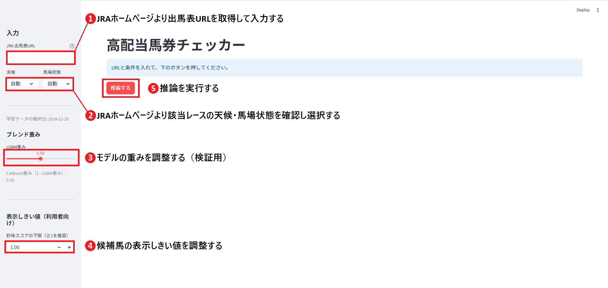

# keiba-highpayout-multiple-checker

## 概要
- 目的 : [netkeiba](https://www.netkeiba.com/) からスクレイピングした 2023–2024 年のレースデータを用い、レース毎に **複勝配当率 上位15%** に入る馬（`HighPayoutHorse`）を予測
- 最終モデル : **LightGBM + CatBoost のアンサンブル**
- 推論・可視化 : Streamlit（`04_app.py`）

## 依存パッケージ（requirements）
本プロジェクトで使用する主な外部ライブラリは `requirements.txt` に記載しています。  
（Keras/TensorFlow は最終不採用のため未記載。）

## ディレクトリ構成
├── 02_horse_preprocess_submission.ipynb   # 前処理・特徴量生成<br>
├── 03_modeling.ipynb                      # 学習・CV・アンサンブル・評価<br>
├── 04_app.py                              # Streamlit アプリ<br>
├── data/<br>
│   └── 02_results_df.pickle               # 前処理後データ<br>
├── models/<br>
│   ├── 03_lgbm_nativecat_odds_tuned.joblib<br>
│   ├── 03_catboost_odds_features.cbm<br>
│   ├── 03_catboost_cat_cols.json<br>
│   └── 03_lgbm_cat_levels.json<br>
├── requirements.txt<br>
├── README.md<br>
└── assets/<br>
    └── app_sidebar_annotated.png<br>

## クイックスタート
**前提**: Python 3.11.6

```bash
- 仮想環境 & 依存関係
python -m venv .venv
# Windows: .venv\Scripts\activate
source .venv/bin/activate
pip install -r requirements.txt

- 既存モデルでアプリ起動（推奨）
# models/ に学習済みモデルがある前提
streamlit run 04_app.py

## 使い方



